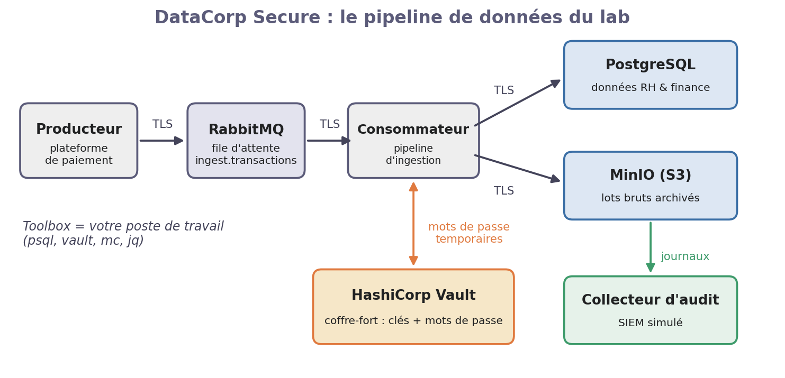
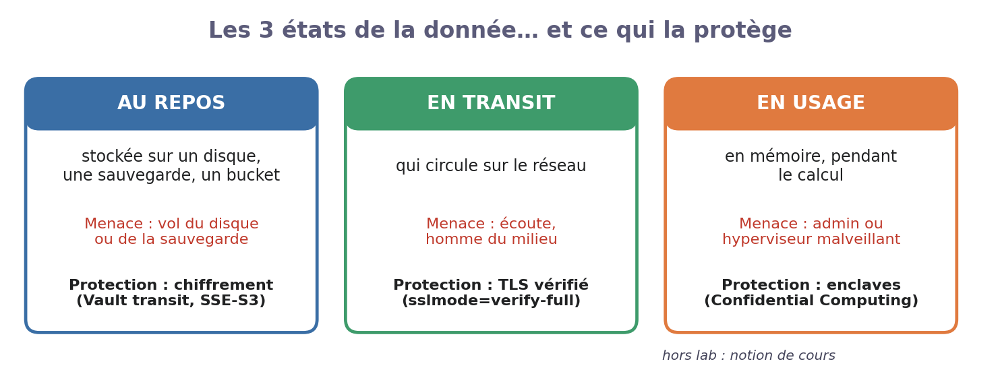
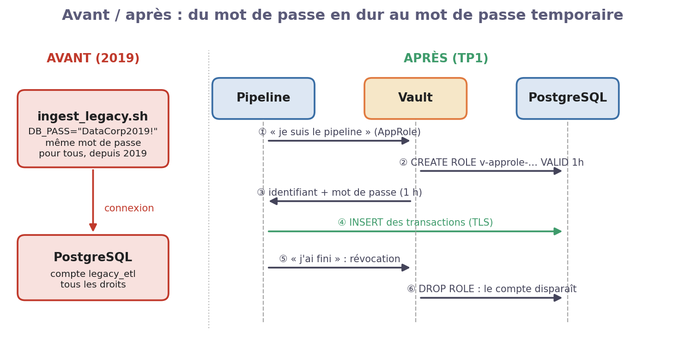
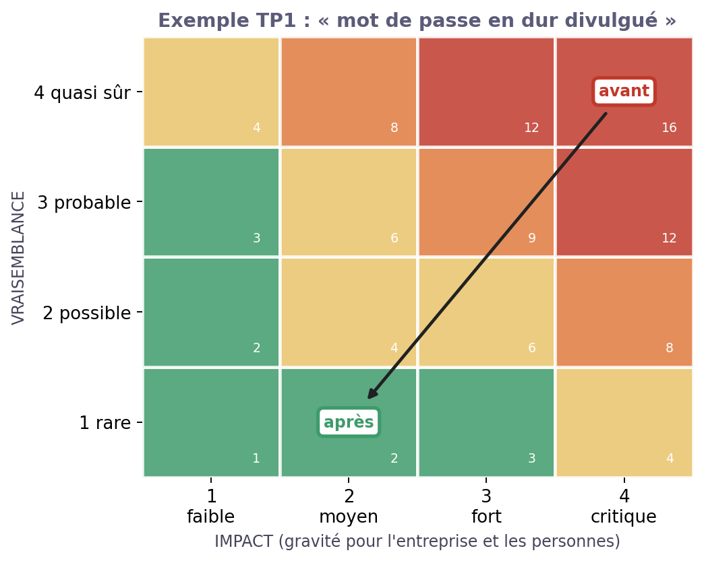

# TP1 — Protéger les secrets et chiffrer les données

**Module Sécurité des Données & DevSecOps — Projet fil rouge « DataCorp Secure »**

*Séance 1 sur 3 · Chiffrement & gestion des secrets*

| | |
|---|---|
| **Durée** | 3 h 30 |
| **Modalité** | Binôme, sur le lab commun de la classe |
| **Rendu** | Compte rendu de 2 pages : une capture par étape ✅ + la fiche GRC du §6.3 |
| **Outils** | HashiCorp Vault, PostgreSQL, OpenSSL |

## Contexte

DataCorp Secure est une FinTech qui gère des données RH (salaires, IBAN, n° de sécurité sociale) et financières. Un audit vient de découvrir que le vieux script d'ingestion contient **tous les mots de passe en clair**, et que les IBAN sont stockés **en clair** en base. Votre mission : tout mettre sous clé avec HashiCorp Vault.



## 1. Le cours en bref



- **Chiffrement symétrique** (AES-256) : une seule clé, très rapide. On l'utilise pour chiffrer les données.
- **Chiffrement asymétrique** (RSA, courbes elliptiques) : une clé publique et une clé privée. On l'utilise pour échanger une clé ou prouver l'identité d'un serveur (certificat TLS).
- **Secret statique ou dynamique** : un mot de passe écrit dans un script vit pour toujours et tout le monde le partage. Un mot de passe **dynamique** est créé à la demande, pour une seule application, et **expire** tout seul.
- **Le vrai sujet, c'est la clé** : chiffrer ne sert à rien si la clé est stockée à côté des données.

## 2. L'outil : HashiCorp Vault

Vault est le **coffre-fort** de l'entreprise. Retenez 4 notions :

| Notion | En une phrase | Commande type |
|---|---|---|
| Coffre scellé | Au démarrage, Vault est fermé : il faut 3 clés sur 5, tenues par 3 personnes différentes | `vault operator unseal` |
| Moteurs | `kv` range un secret, `transit` chiffre une donnée, `database` crée des mots de passe temporaires | `vault secrets enable transit` |
| Politique | Qui a le droit de faire quoi dans le coffre | `vault policy read ingest-pipeline` |
| Journal d'audit | Chaque demande est tracée (qui, quoi, quand) | `vault audit enable file …` |

**Se connecter au lab** : ouvrez l'adresse donnée par le formateur et entrez votre **prénom** et votre **nom**. Le lab est **commun à toute la classe** : votre nom s'affiche à côté des étapes que vous lancez. Dans l'onglet **Terminal**, tapez :

```bash
/lab/scripts/check-stack.sh          # tout doit être [OK] ; Vault est « scellé » (fermé)
```

## 3. Mission

| Rôle | Personne | Ce qu'elle fait aujourd'hui |
|---|---|---|
| Data Security Engineer | Samira | Met en service Vault et décide des règles |
| Data Engineer | Alice | Fait tourner le pipeline sans aucun mot de passe écrit |
| DPO | Claire | Veut la **preuve** que les IBAN sont protégés (RGPD art. 32) |

Dans le binôme, l'un joue Samira, l'autre Alice. Changez de rôle à l'étape 4.

## 4. Manipulations guidées

**Où taper les commandes ?** Dans l'onglet **Terminal** de la console web (adresse donnée par le formateur ; entrez votre prénom et votre nom). Une commande par ligne, Ctrl+Entrée pour lancer. Remplacez chaque `<valeur>` par ce que la commande précédente a affiché. Le bouton **🔑 Voir les identifiants** donne tous les mots de passe du lab et les liens vers Vault, MinIO et RabbitMQ.

Chaque étape suit la même démarche : **🎯 Pourquoi → ▶ Faire → ✅ Vérifier**. Faites une capture de chaque ✅.

**Aide-mémoire**

| Commande | À quoi elle sert |
|---|---|
| `sql "SELECT …"` | une requête SQL en administrateur (le mot de passe est lu dans Vault) |
| `sql -f fichier.sql` | exécuter un fichier SQL |
| `sql-as bruno "SELECT …"` | une requête **en tant que** alice, bruno, claire, david, samira ou nadia (à partir du TP2) |
| `vault status` | état du coffre (`Sealed true` = fermé) |
| `vault-cles` | les 5 clés d'ouverture et le jeton root de Vault |
| `cat fichier` | lire un script avant de le lancer |
| `logs tout` | les journaux d'audit, lisibles (`logs audit`, `logs echecs`, `logs minio`, `logs vault`) |
| `$POSTGRES_PASSWORD`… | les mots de passe du fichier `.env` sont déjà dans des variables |

### Étape 1 — Constater le problème

*Samira (Data Security Engineer)*

> 🎯 On ne corrige bien que ce qu'on a mesuré : trouvons les mots de passe écrits en clair.

```bash
cat /lab/scripts/legacy/ingest_legacy.sh                   # lisez le vieux script
grep -n "PASS\|SECRET\|KEY" /lab/scripts/legacy/ingest_legacy.sh   # les mots de passe en clair
bash /lab/scripts/legacy/ingest_legacy.sh                  # il marche encore !
head -3 /tmp/export_rh_*.csv                               # le fichier exporté : IBAN lisibles
```

✅ **Vérifier :** Vous trouvez 3 mots de passe (PostgreSQL, MinIO, RabbitMQ) et le fichier exporté contient des IBAN en clair (FR76…).

### Étape 2 — Ouvrir le coffre-fort

*Samira*

> 🎯 Vault démarre fermé. À l'ouverture, il fabrique 5 clés : il en faut 3 pour l'ouvrir. Personne ne peut donc l'ouvrir seul.

```bash
vault status                                       # Initialized false, Sealed true : coffre neuf et fermé
vault operator init -format=json > /lab/work/vault-init.json   # crée 5 clés + 1 jeton administrateur
vault-cles                                         # affiche les 5 clés et le jeton root
vault operator unseal <clé 1>                      # 1re clé…
vault operator unseal <clé 2>                      # 2e clé…
vault operator unseal <clé 3>                      # 3e clé : le coffre s'ouvre
vault login <jeton root>                           # on se connecte en administrateur
vault audit enable file file_path=/vault/logs/audit.log   # Vault note tout ce qu'on lui demande
vault status                                       # Sealed false
```

✅ **Vérifier :** vault status affiche Sealed false.

### Étape 3 — Ranger les mots de passe administrateur

*Samira*

> 🎯 Les mots de passe « super-admin » ne doivent plus traîner dans des fichiers : on les range dans le coffre (compte « bris de glace »).

```bash
vault secrets enable -path=kv kv-v2                # ouvre un tiroir « kv » pour ranger des secrets
vault kv put kv/datacorp/break-glass/postgres username=postgres password=$POSTGRES_PASSWORD
vault kv put kv/datacorp/break-glass/minio    username=$MINIO_ROOT_USER password=$MINIO_ROOT_PASSWORD
vault kv put kv/datacorp/break-glass/rabbitmq username=$RABBITMQ_ADMIN_USER password=$RABBITMQ_ADMIN_PASSWORD
vault kv get kv/datacorp/break-glass/postgres      # on relit le secret rangé
sql "SELECT current_user"                          # « sql » lit le mot de passe dans Vault
```

✅ **Vérifier :** vault kv get renvoie le secret, et sql "SELECT current_user" répond postgres.

### Étape 4 — Des mots de passe temporaires pour PostgreSQL

*Alice (Data Engineer)*

> 🎯 Au lieu d'un mot de passe éternel, Vault crée à la demande un compte valable 1 heure, qui peut seulement ajouter des transactions.



```bash
cat /lab/scripts/setup/tp1-db-dynamique.sh        # lisez : ce que le script configure dans Vault
/lab/scripts/setup/tp1-db-dynamique.sh            # Vault sait maintenant créer des comptes PostgreSQL
vault read database/creds/app-ingest              # un compte tout neuf : notez username, password, lease_id
PGPASSWORD=<password> psql -U <username> -c "SELECT count(*) FROM finance.transactions"   # refusé : il ne peut qu'écrire
vault lease revoke <lease_id>                     # on supprime le compte tout de suite
PGPASSWORD=<password> psql -U <username> -c "SELECT 1"                                   # échec : il n'existe plus
```

✅ **Vérifier :** La lecture est refusée (permission denied), puis la connexion échoue après la révocation.

### Étape 5 — Chiffrer les IBAN

*Alice*

> 🎯 Si quelqu'un vole une copie de la base, il ne doit lire que du charabia. La clé reste dans Vault, la base ne garde que le texte chiffré.



```bash
vault secrets enable transit                       # le moteur qui chiffre à la demande
vault write -f transit/keys/datacorp-pii           # crée une clé AES-256 (elle ne sort jamais de Vault)
vault write transit/encrypt/datacorp-pii plaintext=$(echo -n "FR7630001007941234567890185" | base64)   # Vault veut du base64
vault write -f transit/keys/datacorp-pii/rotate    # nouvelle version de la clé (v2)
/lab/scripts/setup/tp1-chiffrer-existant.sh        # chiffre tous les IBAN déjà en base
sql "SELECT matricule, left(iban, 30) FROM rh.employes LIMIT 3"
```

✅ **Vérifier :** Les IBAN commencent maintenant par vault:v2:.

### Étape 6 — Brancher tout le pipeline et vérifier le chiffrement réseau

*Alice*

> 🎯 On applique la même idée à RabbitMQ et MinIO (script fourni), puis on vérifie que tout circule chiffré (TLS).

```bash
/lab/scripts/setup/tp1-pipeline.sh                 # branche RabbitMQ + MinIO sur Vault et lance le pipeline
sql "SELECT ingere_par, count(*) FROM finance.transactions GROUP BY 1"    # qui a écrit les transactions ?
sql "SELECT ssl, version FROM pg_stat_ssl WHERE pid = pg_backend_pid()"   # notre connexion est-elle chiffrée ?
psql "host=postgres user=postgres sslmode=disable" -c "SELECT 1"          # sans chiffrement : refusé
```

✅ **Vérifier :** Les transactions sont écrites par un compte v-approle-…, la connexion est en TLSv1.3, et la connexion sans chiffrement est refusée.

### Étape 7 — Fermer l'ancien accès

*Samira*

> 🎯 Le vieux compte legacy_etl et son mot de passe connu de tous doivent disparaître.

```bash
sql "ALTER ROLE legacy_etl NOLOGIN PASSWORD NULL"   # on ferme le vieux compte
bash /lab/scripts/legacy/ingest_legacy.sh          # le vieux script échoue maintenant
rm -f /tmp/export_rh_*.csv                         # on détruit l'export en clair
```

✅ **Vérifier :** Le vieux script échoue.

## 5. Questions de compréhension

1. À l'étape 2, pourquoi faut-il **3 personnes** pour ouvrir Vault ? Que se passe-t-il si une seule clé est volée ?
2. À l'étape 4, le compte temporaire peut-il **lire** les transactions ? Pourquoi est-ce une bonne chose ?
3. À l'étape 5, chiffrez deux fois le même IBAN : obtenez-vous le même résultat ? Que veut dire `v2` dans `vault:v2:` ?
4. À l'étape 6, qu'aurait-on risqué avec `sslmode=require` au lieu de `verify-full` ? (indice : on chiffre, mais on ne vérifie pas **qui** répond)

## 6. Volet GRC : analyser un risque

### 6.1 Le framework : la méthode en 4 étapes

La GRC (Gouvernance, Risques, Conformité) sert à **justifier** chaque mesure de sécurité devant la direction, un auditeur ou la CNIL. Dans les 3 TP, on applique toujours la même démarche :


| Étape | La question à se poser | L'outil de ce TP |
|---|---|---|
| 1. Identifier | Quelle donnée ? Est-elle personnelle ? Très sensible ? | La classification (PUBLIC → RESTREINT) |
| 2. Évaluer | Que peut-il arriver ? Avec quelle **vraisemblance** (1 à 4) et quel **impact** (1 à 4) ? | La **matrice de risques** : criticité = V × I |
| 3. Traiter | Quelle mesure réduit le risque ? Quel texte l'exige ? | RGPD art. 32, ISO 27001 |
| 4. Prouver | Quelle preuve montre que la mesure fonctionne ? | Une commande et son résultat, un log |

**Lire la matrice :** vert (1 à 3) = acceptable ; jaune (4 à 6) = à surveiller ; orange (8 à 9) = à traiter ; rouge (12 à 16) = à traiter **en urgence**.

### 6.2 Exemple corrigé : « le mot de passe en dur est divulgué »


| Étape | Réponse |
|---|---|
| **1. Identifier** | Donnée : base RH et finance (IBAN, NIR, salaires) → **RESTREINT**, données personnelles. Accès : compte `legacy_etl`, mot de passe écrit dans un script. |
| **2. Évaluer (avant)** | Scénario : le script est publié sur un dépôt Git public. Vraisemblance **4** (c'est déjà arrivé). Impact **4** (lecture de toute la base). Criticité **16 → rouge**. |
| **3. Traiter** | Comptes temporaires Vault (étape 4), IBAN chiffrés (étape 5), ancien compte fermé (étape 7). Texte : **RGPD art. 32** (chiffrement, confidentialité) et **ISO 27001 A.5.17** (gestion des mots de passe). |
| **2 bis. Réévaluer (après)** | Un mot de passe volé expire en 1 h et ne permet qu'un INSERT. Vraisemblance **1**, impact **2**. Criticité **2 → vert**. |
| **4. Prouver** | Capture de l'étape 4 (lecture refusée, compte supprimé après révocation) + ligne du journal Vault montrant qui a obtenu le compte. |

### 6.3 À vous : « une sauvegarde de la base est volée »

Un prestataire perd un disque contenant une sauvegarde de la base PostgreSQL. Remplissez la même fiche :

1. **Identifier** — Quelles données de la sauvegarde sont personnelles ? Lesquelles sont très sensibles ?
2. **Évaluer** — Donnez une vraisemblance et un impact **avant** le TP, puis **après** l'étape 5. Placez les deux points sur la matrice.
3. **Traiter** — Quelle mesure du TP réduit ce risque ? Quelle donnée reste pourtant **en clair** dans la sauvegarde ?
4. **Prouver** — Quelle commande du TP montre à la DPO que les IBAN sont chiffrés ?

## 7. Barème (sur 20)

| Critère | Points |
|---|---|
| Étapes 1 à 7 réalisées, avec une capture par ✅ | 8 |
| Questions de compréhension (§5) | 4 |
| Fiche GRC complète et cohérente (§6.3) | 6 |
| Clarté du compte rendu | 2 |

## 8. Pistes de correction (usage formateur)

*Ne pas distribuer avant le rendu.* Le script `./solutions/run.sh tp1` amène une stack à l'état « fin de TP1 ».

- **Étape 1** — Secrets : `legacy_etl/DataCorp2019!` (tous droits sur rh et finance), `minio-root` (admin MinIO), `rmq-admin` (admin RabbitMQ). Autres défauts : export en `/tmp` lisible par tous, mot de passe affiché par `echo`.
- **Q1** — Partage de secret de Shamir : une clé seule ne révèle rien ; il faut 3 complices. Dans le lab, les 5 clés sont dans le même fichier : c'est un raccourci à signaler.
- **Q2** — Non : le rôle `app_ingest` n'a que INSERT. Moindre privilège : même volé, le compte ne permet pas de lire la base.
- **Q3** — Non : le mode AES-GCM utilise un nonce aléatoire, le chiffré change à chaque fois. `v2` = version de la clé après rotation.
- **Q4** — `require` chiffre sans vérifier le certificat : un pirate placé entre les deux (homme du milieu) pourrait se faire passer pour le serveur.
- **§6.3** — Données personnelles : noms, e-mails, NIR, IBAN, salaires. Avant : V 2, I 4 = 8 (orange). Après : les IBAN sont chiffrés, mais les **NIR, noms et salaires restent en clair** : V 2, I 3 = 6 (jaune). Mesure complémentaire à proposer : chiffrement des sauvegardes et du disque. Preuve : `SELECT left(iban,30) …` montrant `vault:v2:`. Point bonus : les anciens IBAN restent sur le disque tant qu'on n'a pas fait `VACUUM FULL`.
