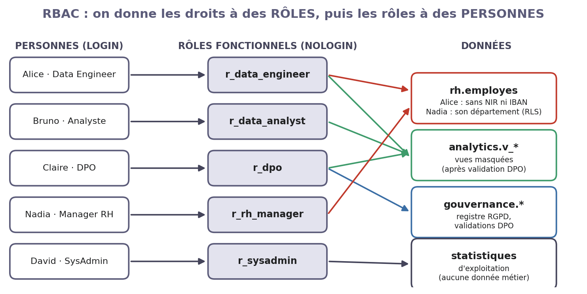
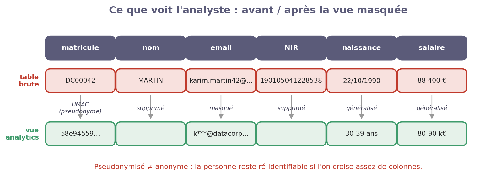
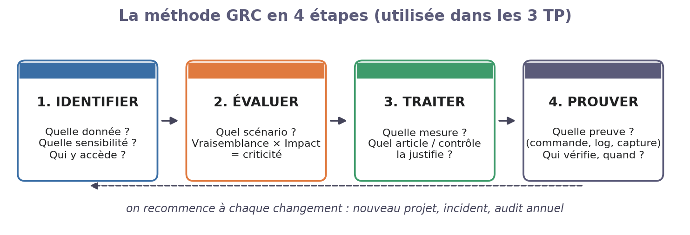
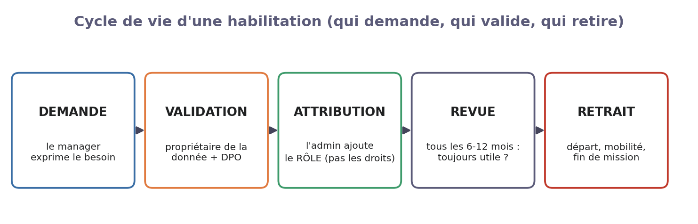

# TP2 — Qui a le droit de voir quoi ? (RBAC & anonymisation)

**Module Sécurité des Données & DevSecOps — Projet fil rouge « DataCorp Secure »**

*Séance 2 sur 3 · Contrôle d'accès & gouvernance des rôles*

| | |
|---|---|
| **Durée** | 3 h 30 |
| **Modalité** | Binôme, sur la stack du TP1 (sinon, le formateur lance `./solutions/run.sh tp1`) |
| **Rendu** | Compte rendu de 2 pages : une capture par étape ✅ + la fiche GRC du §6.3 |
| **Outils** | PostgreSQL (rôles, RLS, vues), MinIO (politiques S3) |

## Contexte

L'équipe Data veut analyser la masse salariale. Aujourd'hui, la seule solution est une extraction complète de la table RH… avec les n° de sécurité sociale, les IBAN et les salaires nominatifs. Claire, la DPO, refuse : **chacun ne doit voir que ce dont il a besoin**, et les analystes ne doivent voir que des données **masquées**.

## 1. Le cours en bref

- **Authentification** = prouver *qui* je suis (TP1). **Autorisation** = ce que j'ai le *droit* de faire (ce TP).
- **RBAC** (*Role-Based Access Control*) : on donne les droits à un **rôle** (« analyste »), puis le rôle à une **personne** (« Bruno »). Quand Bruno change de poste, on change son rôle ; on ne refait pas tous ses droits.
- **Moindre privilège** : le strict nécessaire pour faire son travail. **Séparation des tâches** : celui qui prépare n'est pas celui qui valide.
- **Pseudonymiser ≠ anonymiser** : une donnée pseudonymisée reste personnelle (RGPD art. 4.5). Seule une donnée vraiment anonyme sort du RGPD.



## 2. Les outils en 5 minutes

| Besoin | Mécanisme PostgreSQL | Exemple |
|---|---|---|
| Un groupe de droits | `CREATE ROLE r_data_analyst NOLOGIN` | le rôle « analyste » |
| Une personne | `CREATE ROLE bruno LOGIN IN ROLE r_data_analyst` | Bruno reçoit le rôle |
| Limiter les **colonnes** | `GRANT SELECT (departement, poste) ON rh.employes` | pas de NIR |
| Limiter les **lignes** | *Row Level Security* : `CREATE POLICY …` | Nadia ne voit que son service |
| Masquer | Une **vue** qui transforme les colonnes | e-mail → `k***@…` |

Côté stockage objet, MinIO utilise des **politiques JSON** : `"Effect": "Allow"` ou `"Deny"`, une liste d'actions (`s3:GetObject`…) et de buckets. Un `Deny` l'emporte toujours.

## 3. Mission

| Rôle | Personne | Ce qu'elle fait aujourd'hui |
|---|---|---|
| DPO | Claire | **Définit** les règles et **valide** chaque vue avant ouverture |
| Data Engineer | Alice | **Met en place** les rôles et les vues ; ne peut pas s'auto-valider |
| Data Analyst | Bruno | **Utilise** les données masquées |
| Manager RH | Nadia | Consulte les salariés de **son** département (Finance) |

Dans le binôme : l'un joue Alice (technique), l'autre Claire (règles et tests de refus).

## 4. Manipulations guidées

Démarche à chaque étape : **🎯 Pourquoi → ▶ Faire → ✅ Vérifier**. Tout se passe dans la toolbox (`docker compose exec toolbox bash`). Si Vault est scellé : `/lab/scripts/vault-unseal.sh`.

### Étape 1 — Lire la politique de la DPO

> 🎯 On ne crée pas de droits au hasard : on part de la **classification** des données faite par la DPO.

```bash
/lab/scripts/pg-admin.sh -c "SELECT table_name, column_name, niveau, traitement_requis
  FROM gouvernance.classification_donnees WHERE schema_name = 'rh' ORDER BY niveau DESC"
```

✅ **Vérifier :** vous savez quelles colonnes sont `RESTREINT` (NIR, IBAN, salaire) et ce qu'il faut en faire (SUPPRIMER, CHIFFRER, GÉNÉRALISER…).

### Étape 2 — Créer les rôles, puis les comptes

> 🎯 D'abord les rôles (**ce que l'on fait**), ensuite les personnes (**qui l'on est**).

```bash
less /lab/scripts/sql/tp2/01-roles.sql                     # lisez les GRANT : un bloc par rôle
/lab/scripts/pg-admin.sh -f /lab/scripts/sql/tp2/01-roles.sql
/lab/scripts/setup/tp2-comptes.sh                          # 6 comptes, mots de passe rangés dans Vault
# petite fonction pour agir « en tant que » quelqu'un :
as() { u=$1; shift; PGPASSWORD="$(vault kv get -field=password kv/datacorp/users/pg/$u)" psql -U "$u" -c "$*"; }
```

✅ **Vérifier :** `/lab/scripts/pg-admin.sh -c "\du"` montre `alice` membre de `r_data_engineer`, `bruno` de `r_data_analyst`, etc.

### Étape 3 — Tester le moindre privilège

> 🎯 Une règle de sécurité ne vaut que si on a **vérifié qu'elle bloque**.

```bash
as bruno "SELECT * FROM rh.employes LIMIT 1"                       # l'analyste : refusé
as alice "SELECT nir FROM rh.employes LIMIT 1"                     # colonne NIR : refusé
as alice "SELECT matricule, departement FROM rh.employes LIMIT 2"  # colonnes autorisées : OK
as david "SELECT count(*) FROM finance.transactions"               # l'admin système : refusé
```

✅ **Vérifier :** 3 refus (`permission denied`) et 1 succès. Notez-les dans un tableau « test / attendu / obtenu ».

### Étape 4 — Filtrer les lignes (Row Level Security)

> 🎯 Nadia a besoin des fiches de **son** département, pas de toute l'entreprise.

```bash
less /lab/scripts/sql/tp2/02-rls.sql
/lab/scripts/pg-admin.sh -f /lab/scripts/sql/tp2/02-rls.sql
as nadia "SELECT departement, count(*) FROM rh.employes GROUP BY 1"
```

✅ **Vérifier :** Nadia ne voit qu'**une** ligne : `Finance | 32`.

### Étape 5 — Masquer les données pour les analystes

> 🎯 Bruno doit pouvoir compter, comparer, faire des moyennes… sans jamais voir **qui** est qui.



```bash
less /lab/scripts/sql/tp2/03-vues-masquees.sql             # repérez HMAC, masquer_email, tranche_age
/lab/scripts/pg-admin.sh -f /lab/scripts/sql/tp2/03-vues-masquees.sql
as claire "SELECT * FROM analytics.v_employes LIMIT 3"     # la DPO regarde le résultat
as claire "SELECT count(*) AS personnes_uniques FROM (SELECT departement, poste, tranche_age, annee_embauche
           FROM analytics.v_employes GROUP BY 1,2,3,4 HAVING count(*) = 1) x"
```

✅ **Vérifier :** aucun nom, NIR ou IBAN dans la vue. Notez le nombre de « personnes uniques » (question 3).

### Étape 6 — Faire valider par la DPO avant d'ouvrir

> 🎯 Séparation des tâches : Alice prépare, Claire valide, et **seulement après** la vue est ouverte aux analystes.

```bash
/lab/scripts/pg-admin.sh -f /lab/scripts/sql/tp2/04-publication.sql
as alice  "SELECT analytics.publier_vue('analytics.v_employes')"     # refusé : pas encore validée
as claire "INSERT INTO gouvernance.validations_dpo (objet, decision, commentaire)
           VALUES ('analytics.v_employes', 'APPROUVE', 'Pas d''identifiant direct')"
as alice  "SELECT analytics.publier_vue('analytics.v_employes')"     # accepté
as bruno  "SELECT departement, tranche_salaire, count(*) FROM analytics.v_employes GROUP BY 1,2 LIMIT 5"
```

✅ **Vérifier :** la publication est refusée avant la validation, acceptée après, et Bruno lit enfin la vue.

### Étape 7 — Les mêmes règles sur le stockage objet (MinIO)

> 🎯 Les fichiers doivent suivre les mêmes règles que la base : Bruno lit la zone `curated` (données masquées), jamais la zone `raw-data` (données brutes).

```bash
cat /lab/minio-policies/data-analyst.json                  # une seule règle : lecture de "curated"
/lab/scripts/setup/tp2-minio.sh && source /root/.minio-alias
mc ls bruno/raw-data/                                      # refusé
mc cp /etc/hostname bruno/curated/test.txt                 # refusé : lecture seule
mc ls alice/raw-data/transactions/ | head -3               # Alice (Data Engineer) : OK
```

✅ **Vérifier :** 2 refus pour Bruno, 1 succès pour Alice.

## 5. Questions de compréhension

1. Pourquoi donne-t-on les droits à `r_data_analyst` et pas directement à `bruno` ? Que faites-vous le jour où Bruno quitte l'entreprise ?
2. À l'étape 4, Nadia voit les salariés de Finance. Peut-elle lire leur NIR ? Pourquoi ? (indice : lignes ≠ colonnes)
3. À l'étape 5, combien de personnes sont « uniques » sur 200 ? La vue est-elle **anonyme** ou seulement **pseudonymisée** ? Proposez une colonne à retirer pour réduire ce nombre.
4. À l'étape 6, qu'est-ce qui empêche Alice de valider elle-même sa vue ?

## 6. Volet GRC : gouverner les habilitations

### 6.1 Le framework : la méthode en 4 étapes, appliquée aux droits d'accès

On reprend la même méthode qu'au TP1. Ici, l'objet analysé est une **demande d'accès** : qui veut voir quelle donnée, et pourquoi ?



| Étape | La question pour une demande d'accès | L'outil de ce TP |
|---|---|---|
| 1. Identifier | Quelle donnée est demandée ? Quel niveau de classification ? | `gouvernance.classification_donnees` |
| 2. Évaluer | Le besoin est-il **justifié** par la mission ? Que se passe-t-il si l'accès est détourné ? | Le principe du **besoin d'en connaître** |
| 3. Traiter | Donner le **minimum** : rôle, colonnes, lignes, ou vue masquée | La **matrice d'habilitations** |
| 4. Prouver | Qui a validé ? Les droits sont-ils revus régulièrement ? | Table `validations_dpo`, revue annuelle |

Une habilitation a une **vie** : elle se demande, se valide, s'attribue, se revoit… et se retire.



### 6.2 Exemple corrigé : « Nadia demande l'accès aux fiches RH »

| Étape | Réponse |
|---|---|
| **1. Identifier** | Donnée : `rh.employes`. Colonnes demandées : nom, poste, salaire, NIR, IBAN. Niveau : **RESTREINT** (NIR, IBAN, salaire). |
| **2. Évaluer** | Besoin réel : gérer son équipe (entretiens annuels, salaires). Elle n'a besoin **ni du NIR ni de l'IBAN** (c'est le travail de la paie), ni des autres départements. Risque si accès complet : fuite de 200 dossiers → impact 4. |
| **3. Traiter** | Rôle `r_rh_manager` : colonnes sans NIR ni IBAN + RLS sur le département Finance. Base légale : exécution du contrat de travail. Texte : **RGPD art. 5.1.c** (minimisation) et **ISO 27001 A.5.15** (contrôle d'accès). |
| **4. Prouver** | Capture de l'étape 4 (une seule ligne, Finance) + refus de lire le NIR + ligne dans la matrice d'habilitations, avec une date de revue (dans 12 mois). |

**La matrice d'habilitations** qui en résulte (extrait) :

| Rôle | rh.employes | analytics.v_* | gouvernance.* | Validé par | Revue |
|---|---|---|---|---|---|
| r_rh_manager | Lecture, sans NIR/IBAN, son département | — | — | DPO + DRH | 09/2027 |
| r_data_analyst | — | Lecture | — | DPO | 09/2027 |

### 6.3 À vous : « Bruno demande les salaires nominatifs »

Bruno veut « le salaire exact de chaque personne, avec son nom, pour mieux prédire les départs ». Remplissez la même fiche :

1. **Identifier** — Quelles colonnes demande-t-il ? Quel est leur niveau de classification ?
2. **Évaluer** — Le nom est-il vraiment nécessaire pour prédire des départs ? Que risque-t-on si son accès est détourné ?
3. **Traiter** — Que lui accordez-vous à la place ? (indice : ce qui existe déjà dans `analytics`)
4. **Prouver** — Complétez la ligne `r_data_analyst` de la matrice et indiquez qui valide, et quand revoir cet accès.

## 7. Barème (sur 20)

| Critère | Points |
|---|---|
| Étapes 1 à 7 réalisées, avec une capture par ✅ | 8 |
| Questions de compréhension (§5) | 4 |
| Fiche GRC complète et cohérente (§6.3) | 6 |
| Clarté du compte rendu | 2 |

## 8. Pistes de correction (usage formateur)

*Ne pas distribuer avant le rendu.* Le script `./solutions/run.sh tp2` amène une stack à l'état « fin de TP2 ».

- **Q1** — Le rôle survit aux mouvements de personnel et rend la revue lisible. Départ : `ALTER ROLE bruno NOLOGIN`, puis `DROP ROLE bruno` et suppression de ses comptes MinIO et Vault. `VALID UNTIL` (déjà posé sur Bruno) n'expire que le mot de passe.
- **Q2** — Non : la RLS filtre les **lignes**, les privilèges par colonne filtrent les **colonnes**, et les deux s'appliquent.
- **Q3** — Environ 170 personnes uniques sur 200 : la vue est **pseudonymisée** (réidentifiable par recoupement), donc toujours soumise au RGPD. Retirer `annee_embauche` fait tomber à environ 68 ; élargir les tranches d'âge ou n'utiliser que des vues agrégées (`v_salaires_par_departement`, groupes d'au moins 5 personnes) réduit encore.
- **Q4** — Alice n'a pas le droit d'écrire dans `validations_dpo` (réservé à `r_dpo`), et la fonction `publier_vue` exige une décision `APPROUVE`. Seul un superutilisateur peut contourner le circuit : c'est ce que détectera le TP3.
- **§6.3** — Colonnes : nom (CONFIDENTIEL), salaire (RESTREINT). Le nom n'est pas nécessaire à un modèle statistique → refus. On accorde `analytics.v_employes` (pseudonyme HMAC + tranche de salaire) ou l'agrégat `v_salaires_par_departement`. Validation : DPO (+ DRH, propriétaire de la donnée). Revue : 12 mois, ou fin de mission (bruno `VALID UNTIL 2027-06-30`). Texte : RGPD art. 5.1.c et art. 25 (protection des données dès la conception).
