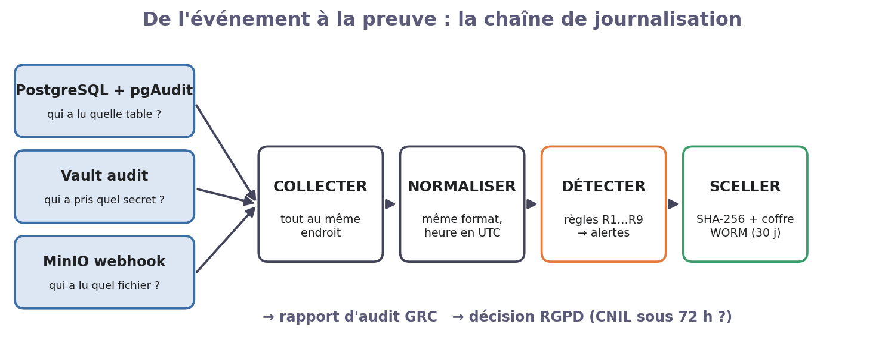
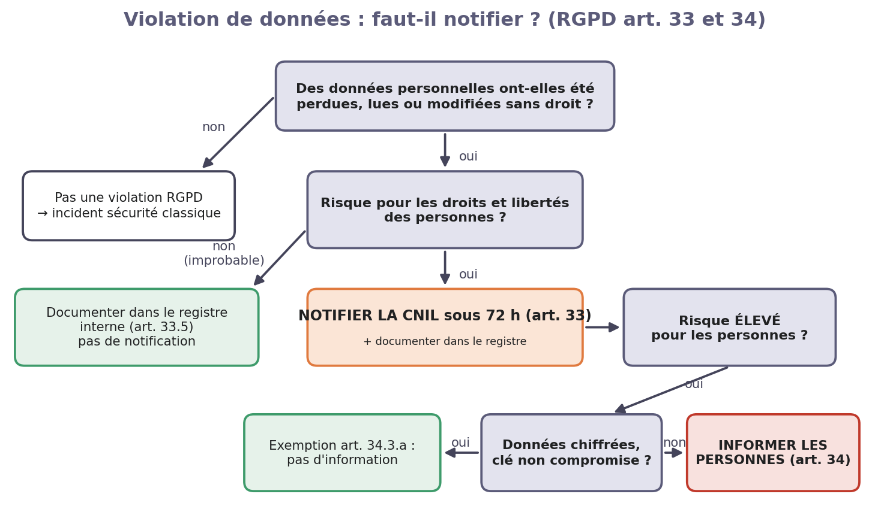

# TP3 — Tracer, détecter, prouver (audit & conformité)

**Module Sécurité des Données & DevSecOps — Projet fil rouge « DataCorp Secure »**

*Séance 3 sur 3 · Journalisation, SIEM & conformité RGPD*

| | |
|---|---|
| **Durée** | 3 h 30 |
| **Modalité** | Binôme, sur la stack des TP1 et TP2 (sinon, le formateur lance `./solutions/run.sh tp2`) |
| **Rendu** | Compte rendu de 2 pages : une capture par étape ✅, la chronologie de l'incident et la fiche GRC du §6.3 |
| **Outils** | pgAudit, journal d'audit Vault, webhook d'audit MinIO, `logs`, `detect.py` |

## Contexte

Mercredi matin, la supervision signale une nuit agitée : connexions ratées en série, exports volumineux, accès refusés sur le stockage. Samira doit comprendre **ce qui s'est passé**. Claire, la DPO, a **72 heures** pour décider s'il faut prévenir la CNIL. Problème : aujourd'hui, presque rien n'est journalisé.

## 1. Le cours en bref

- Un bon journal d'audit répond à **5 questions** : **qui** ? **quoi** ? **sur quelle donnée** ? **quand** ? **d'où** ? Et il donne le **résultat** (succès ou refus).
- **On ne journalise pas les données elles-mêmes** : un journal plein d'IBAN devient une nouvelle base sensible.
- Un journal n'a de valeur que s'il est **intègre** : un pirate efface ses traces. On calcule donc une empreinte (SHA-256) et on le range dans un stockage **WORM** (*Write Once, Read Many* : impossible à effacer).
- **Même horloge pour tous** : sans heure commune (UTC), impossible de reconstituer l'ordre des événements.



## 2. Les outils en 5 minutes

| Outil | Ce qu'il trace | Où lire |
|---|---|---|
| **pgAudit** (PostgreSQL) | Qui a lu ou modifié une table sensible, combien de lignes | `/logs/postgres/postgresql.json` |
| **Audit Vault** (activé au TP1) | Qui a demandé quel secret | `/logs/vault/audit.log` |
| **Webhook MinIO** | Qui a lu ou écrit quel fichier | `/logs/minio/audit.jsonl` |
| **logs** | Lire ces journaux sans écrire de filtre | `logs audit`, `logs echecs`, `logs minio`, `logs vault` |
| **detect.py** | Règles de détection → alertes classées | `python3 /lab/scripts/detect.py` |

Une ligne pgAudit se lit ainsi : `AUDIT: OBJECT,1,1,READ,SELECT,TABLE,rh.employes,"SELECT …",<not logged>,200`, soit un accès **objet**, en **lecture**, sur **rh.employes**, avec la requête, **sans** les valeurs, et **200 lignes** lues.

## 3. Mission

| Rôle | Personne | Ce qu'elle fait aujourd'hui |
|---|---|---|
| Data Security Engineer | Samira | Active l'audit, enquête, protège les preuves |
| DPO | Claire | Qualifie l'incident et décide de la notification à la CNIL |
| Formateur | — | Joue l'attaquant (lance la simulation) et l'auditeur (lit le rapport) |

## 4. Manipulations guidées

**Où taper les commandes ?** Dans l'onglet **Terminal** de la console web (adresse donnée par le formateur ; entrez votre prénom et votre nom). Une commande par ligne, Ctrl+Entrée pour lancer. Remplacez chaque `<valeur>` par ce que la commande précédente a affiché. Le bouton **🔑 Voir les identifiants** donne tous les mots de passe du lab et les liens vers Vault, MinIO et RabbitMQ.

Chaque étape suit la même démarche : **🎯 Pourquoi → ▶ Faire → ✅ Vérifier**. Faites une capture de chaque ✅.

**Aide-mémoire**

| Commande | À quoi elle sert |
|---|---|
| `sql "SELECT …"` | une requête SQL en administrateur (le mot de passe est lu dans Vault) |
| `sql -f fichier.sql` | exécuter un fichier SQL |
| `sql-as bruno "SELECT …"` | une requête **en tant que** alice, bruno, claire, david, samira ou nadia (à partir du TP2) |
| `vault status` | état du coffre (`Sealed true` = fermé) |
| `vault-cles` | les 5 clés d'ouverture et le jeton root de Vault |
| `cat fichier` | lire un script avant de le lancer |
| `logs tout` | les journaux d'audit, lisibles (`logs audit`, `logs echecs`, `logs minio`, `logs vault`) |
| `$POSTGRES_PASSWORD`… | les mots de passe du fichier `.env` sont déjà dans des variables |

### Étape 1 — Allumer l'audit PostgreSQL

*Samira*

> 🎯 On veut tracer les accès aux tables RESTREINT et les changements de droits, pas tout le reste (trop de bruit).

```bash
cat /lab/scripts/sql/tp3/01-audit.sql              # repérez le rôle « auditeur »
sql -f /lab/scripts/sql/tp3/01-audit.sql           # active l'audit sur les tables sensibles
sql-as nadia "SELECT nom, poste FROM rh.employes LIMIT 3"   # Nadia lit 3 fiches…
logs audit                                         # …et le journal l'a noté
```

✅ **Vérifier :** Une ligne « nadia  AUDIT: OBJECT,…,rh.employes,…,3 » apparaît.

### Étape 2 — Collecter MinIO et créer le coffre à preuves

*Samira*

> 🎯 Les journaux doivent quitter la machine surveillée et être rangés là où personne ne peut les effacer.

```bash
cat /lab/scripts/setup/tp3-coffre.sh               # lisez : collecte MinIO, coffre WORM, compte de dépôt
/lab/scripts/setup/tp3-coffre.sh                   # met tout en place
/lab/scripts/seal-logs.sh                          # range une 1re archive des journaux dans le coffre
effacer-preuve                                     # on essaie de l'effacer…
```

✅ **Vérifier :** L'effacement est refusé (objet protégé par la rétention WORM).

### Étape 3 — Rejouer l'incident

*Formateur (attaquant)*

> 🎯 On reproduit la « nuit agitée » pour disposer de vraies traces. Ne lisez pas le script avant d'avoir enquêté !

```bash
/lab/scripts/simulate-incidents.sh
```

✅ **Vérifier :** Le script affiche 8 étapes et se termine par « Simulation terminée ».

### Étape 4 — Enquêter à la main

*Samira*

> 🎯 Un bon analyste sait lire les journaux avant de faire confiance à un outil automatique.



```bash
logs echecs      # a) mots de passe ratés, par compte (PostgreSQL)
logs audit       # b) lectures de tables sensibles (PostgreSQL, heure de Paris)
logs minio       # c) accès refusés sur le stockage (MinIO, heure UTC)
logs vault       # d) demandes refusées par le coffre (Vault, heure UTC)
```

✅ **Vérifier :** Au moins 6 événements dans la chronologie, dans le bon ordre (tout converti en UTC : PostgreSQL écrit l'heure de Paris).

### Étape 5 — Détecter automatiquement

*Samira*

> 🎯 On ne peut pas lire des millions de lignes à la main : on écrit des règles qui lèvent des alertes.

```bash
python3 /lab/scripts/detect.py
```

✅ **Vérifier :** Des alertes CRITIQUE, HAUTE et MOYENNE s'affichent. Comparez-les à votre chronologie.

### Étape 6 — Sceller les preuves

*Samira → Claire*

> 🎯 Si l'affaire va plus loin (licenciement, plainte, CNIL), il faudra prouver que les journaux n'ont pas été modifiés.

```bash
/lab/scripts/seal-logs.sh                          # 2e archive, reliée à la 1re
cd /lab/work/scelles && sha256sum -c *.sha256      # chaque archive est intacte ? (OK)
cat /lab/work/scelles/chaine.txt                   # la chaîne des empreintes
```

✅ **Vérifier :** Chaque archive affiche OK, et chaine.txt contient 2 lignes.

## 5. Questions de compréhension

1. Pourquoi ne journalise-t-on **pas** toutes les requêtes (`pgaudit.log = 'all'`) ? Donnez deux raisons.
2. Dans votre chronologie, pourquoi l'heure de Paris et l'heure UTC posent-elles problème ? Quelle est la solution ?
3. À l'étape 2, le compte **root** de MinIO pourrait-il quand même effacer la preuve ? (indice : mode GOVERNANCE ou COMPLIANCE)
4. Parmi les alertes de `detect.py`, laquelle est **la plus grave** selon vous, et pourquoi ?

## 6. Volet GRC : qualifier un incident

### 6.1 Le framework : la méthode en 4 étapes, appliquée à un incident

On reprend la même méthode que dans les TP1 et TP2. Ici, l'objet analysé est un **événement de sécurité** : est-ce une violation de données au sens du RGPD, et que doit-on faire ?


| Étape | La question pour un incident | L'outil de ce TP |
|---|---|---|
| 1. Identifier | Que s'est-il passé ? Quelles données, combien de personnes ? | La chronologie (étape 4) |
| 2. Évaluer | Est-ce une **violation** de données personnelles ? Quel risque pour les personnes ? | L'**arbre de décision** ci-dessous |
| 3. Traiter | Notifier la CNIL (72 h) ? Informer les personnes ? Quelles mesures correctives ? | RGPD art. 33 et 34 |
| 4. Prouver | Quelles traces ? Sont-elles intègres ? Qui a décidé, quand ? | Archives scellées + registre des violations |


À retenir : **toute** violation est inscrite au registre interne (art. 33.5), même quand on ne notifie pas. La notification à la CNIL se fait **sous 72 h**. L'information des personnes n'est obligatoire que si le risque est **élevé**, sauf si les données étaient chiffrées (art. 34.3.a).

### 6.2 Exemple corrigé : « Bruno tente de lire la zone raw-data »

| Étape | Réponse |
|---|---|
| **1. Identifier** | Journal MinIO : 3 requêtes de `bruno` sur `raw-data` → code **403** (refusé). Données visées : lots de transactions (IBAN chiffrés). Aucune donnée obtenue. |
| **2. Évaluer** | Arbre : « des données ont-elles été lues sans droit ? » → **non**, tout a été refusé. Ce n'est **pas une violation RGPD**, mais un **incident de sécurité** (tentative hors périmètre). |
| **3. Traiter** | Pas de notification CNIL. Entretien avec Bruno et son manager (erreur ou curiosité ?). On garde la règle de détection R4. Texte : **ISO 27001 A.5.25** (évaluation des événements de sécurité). |
| **4. Prouver** | Extrait du journal MinIO (3 lignes 403) dans l'archive scellée n°2 + empreinte SHA-256 + décision datée et signée par Samira. |

### 6.3 À vous : « Alice exporte tout l'annuaire RH »

Votre chronologie montre qu'Alice a lu **200 lignes** de `rh.employes` (matricule, département, poste, date d'embauche) et les a écrites dans `/tmp/annuaire.csv`, « pour tester ». Elle a aussi lu les IBAN des 60 clients, qui sont chiffrés (`vault:v2:…`).

1. **Identifier** — Quelles données ont été lues ? Combien de personnes sont concernées ?
2. **Évaluer** — Suivez l'arbre : est-ce une violation ? Alice avait le **droit technique** de lire ces colonnes : cela change-t-il la réponse ? (indice : RGPD art. 5.1.b, finalité)
3. **Traiter** — Faut-il notifier la CNIL ? Informer les 200 salariés ? Informer les clients dont l'IBAN a été lu ? Justifiez chaque réponse avec l'arbre.
4. **Prouver** — Quelles lignes de journal et quelle archive scellée joignez-vous au registre des violations ?

## 7. Barème (sur 20)

| Critère | Points |
|---|---|
| Étapes 1 à 6 réalisées, avec une capture par ✅ | 7 |
| Chronologie de l'incident en UTC | 3 |
| Questions de compréhension (§5) | 4 |
| Fiche GRC complète et justifiée (§6.3) | 6 |

## 8. Pistes de correction (usage formateur)

*Ne pas distribuer avant le rendu.* Le script `./solutions/run.sh tp3` amène une stack à l'état « fin de TP3 ».

- **Q1** — Volume et performance ; et surtout, les requêtes contiennent des valeurs (IBAN, NIR) qui se retrouveraient dans les journaux. On cible les tables RESTREINT grâce au rôle `auditeur`.
- **Q2** — Décalage de 2 h : un tri mélange les événements. Solution : tout convertir en UTC (ou `log_timezone = 'UTC'`), avec des horloges synchronisées par NTP (ISO 27001 A.8.17).
- **Q3** — Oui : en mode GOVERNANCE, le root peut forcer avec `mc rm --bypass`. En mode COMPLIANCE, personne ne le peut, root compris, jusqu'à l'échéance (inconvénient : aucune correction possible en cas d'erreur).
- **Q4** — R3 (lecture massive de `rh.employes` par Alice) ou R7 (tentative d'effacement des preuves) : toute réponse argumentée est acceptée. Faux positif attendu : R5 sur Alice pour un `GRANT` lié à la publication d'une vue (étape 6 du TP2), qui est légitime.
- **§6.3** — 200 salariés ; données d'identification professionnelle, pas de NIR, d'IBAN ni de salaire. C'est une **violation de confidentialité** : l'accès est techniquement autorisé mais sans finalité (art. 5.1.b), donc un détournement. Risque faible si le fichier est supprimé et confiné (à prouver) → inscription au registre (art. 33.5) ; notification CNIL à argumenter (acceptable des deux côtés si c'est justifié) ; pas d'information des salariés (risque non élevé). IBAN clients : chiffrés, clé non compromise → exemption art. 34.3.a. Preuves : lignes pgAudit (200 et 60 lignes), archive scellée n°2, sortie de `sha256sum -c`.
